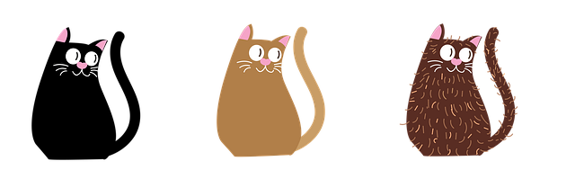

# canvas_filter

Canvas para aplicar filtros a imágenes utilizando Programación Orientada a Objetos

Selecciona una imagen y aplicale uno de los sigientes filtros

-Blanco y Negro
-Negativo
-Aclarar
-Oscurecer
-Flip Horizontal

